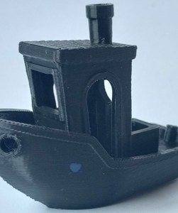
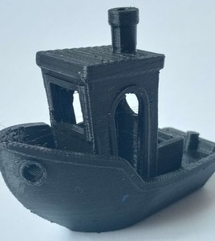
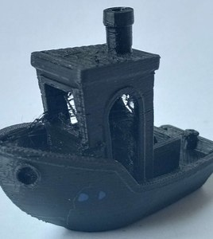
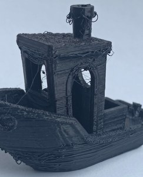
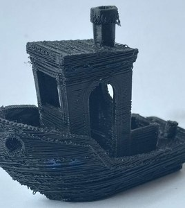
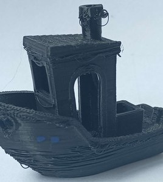
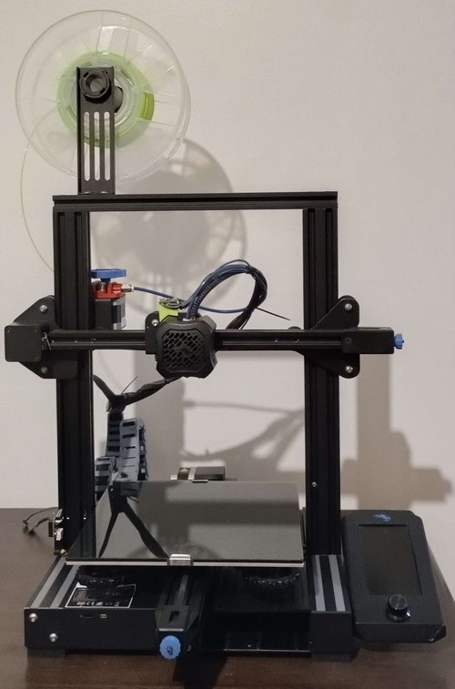
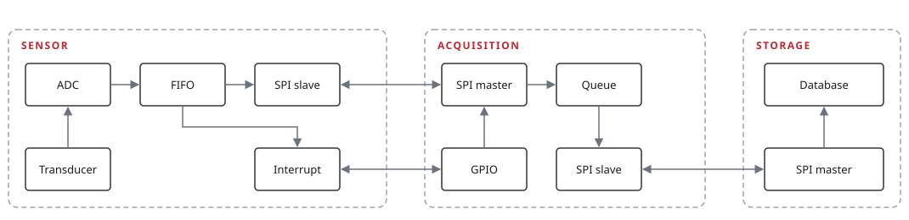

# 3D Printer Failure Detection

Failure detection acquisition, analysis and training

Vibration data is collected from an Ender 3 V2 with a triaxial accelerometer (ADXL345
at 3200 Hz) and used to classify six machine states: nominal, two anomalous extrusion
temperatures (220 °C, 230 °C), a loose X-axis carriage, and two nozzle-obstruction
levels (0.3 mm, 0.2 mm).

## Dataset

27 prints across 6 machine states, ~437.15 M accelerometer samples at 3200 Hz triaxial.
The acquisition hardware failed before the full plan was complete, so the classes are
imbalanced. Published on Zenodo:
[3D Printer Failure Dataset](https://zenodo.org/records/22716165).

| Machine state           | Prints | Samples |
| ------------------------ | -----: | ------: |
| Healthy                  |      6 |  97.67 M |
| Temperature 230 °C       |      6 |  92.95 M |
| Loose X-axis carriage    |      5 |  82.94 M |
| Temperature 220 °C       |      5 |  81.81 M |
| 0.2 mm extrusion nozzle  |      3 |  49.23 M |
| 0.3 mm extrusion nozzle  |      2 |  32.55 M |
| **Total**                | **27** | **437.15 M** |

|  |  |  |
| :--: | :--: | :--: |
| **Healthy** — calibrated machine, no defects | **220 °C** — stringing across the openings | **230 °C** — heavier stringing, surface blobs |

|  |  |  |
| :--: | :--: | :--: |
| **X-axis carriage** — play on the orthogonal axes | **0.2 mm nozzle** — severe under-extrusion | **0.3 mm nozzle** — thin walls, gaps |

## Reproducibility
See [REPRODUCE.md](REPRODUCE.md) for the end-to-end pipeline, from the raw acquisitions
through to the model results, and `repro/` for the scripts that run it. The environment
is managed by [pixi](https://pixi.sh):

```bash
pixi install
pixi run label && pixi run downsample && pixi run features
pixi run -e train train && pixi run -e train evaluate
```

The original notebooks used to develop the pipeline are kept for reference in
[`notebooks/`](notebooks/); `repro/` reproduces the same steps as scripts that run
unattended end to end.

## Acquisition system

A single triaxial accelerometer is read by an ESP32 over SPI and relayed to a Raspberry
Pi 4, which writes it to storage for dataset generation.



**Ender 3 V2** — accelerometer on the X carriage, beside the nozzle



| Stage       | Hardware             | Notes                                                                             |
| ----------- | --------------------- | ---------------------------------------------------------------------------------- |
| Sensor      | ADXL345               | Triaxial, 3200 Hz, ±16 g, 13-bit. 32-sample FIFO over SPI, two interrupt pins for threshold and overflow. |
| Acquisition | ESP32 + FreeRTOS       | Two tasks joined by a queue. Reads the FIFO inside the 10 ms deadline; 153.6 kbps sustained. |
| Storage     | Raspberry Pi 4 → SSD   | Full-duplex SPI echoes each packet back for integrity.                             |

The ESP32 acts as SPI slave (sensor and acquisition sides) and the Raspberry Pi as SPI
master (acquisition and storage sides), using:

- [Esp32 Library](https://github.com/hideakitai/ESP32SPISlave/tree/main)
- [Raspberry pi Library](https://abyz.me.uk/rpi/pigpio/cif.html)

```bash
sudo apt-get update
sudo apt-get install pigpio python-pigpio python3-pigpio
```

## Publications

- Leonardo Kenny Treichel da Cunha, Tiago Oliveira Weber. *Data Acquisition System and
  Fault Detection for 3D Printers Using Intelligent Models*. 2026 10th International
  Symposium on Instrumentation Systems, Circuits and Transducers (INSCIT), São Paulo,
  Brazil, 2026, pp. 1-6.
  doi: [10.1109/INSCIT72361.2026.11707197](https://doi.org/10.1109/INSCIT72361.2026.11707197)
- Leonardo Kenny Treichel da Cunha. *Sistema de aquisição de dados e detecção de falhas
  para impressoras 3D utilizando modelos inteligentes* (Data Acquisition System and Fault
  Detection for 3D Printers Using Intelligent Models). Advisor: Tiago Oliveira Weber.
  Undergraduate thesis, Universidade Federal do Rio Grande do Sul, 2024.
  [lume.ufrgs.br/handle/10183/279376](https://lume.ufrgs.br/handle/10183/279376)
